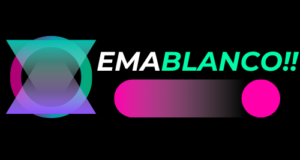

## Hola, soy Ema 

📜 Estoy estudiando ING Informatica............

🌱 Uso lenguajes como SQL Python c++.

🌍  Vivo actualmente en Santa Fe.

⚡ Puedes ver mi portfolio en [EmaBlanco](http://emablanco.github.io).

✉️  O contactarme a través de correo electrónico en [emanuelblanco.073@gmail.com](mailto:emanuelblanco.073@gmail.com). 

🤝  Estoy abierto a colaborar en diferentes proyectos.

<table border="0">
     <tr>
          <td align="center">
               
               
               
               
               
          </td>
     </tr>
     <tr>
          <td align="center">
               
               
               
               
          </td>
     </tr>
      <tr>
          <td align="center">
               
          </td>
     </tr>
     <tr>
          <td align="center">
               
               
               
          </td>
    </tr>
    <tr>
          <td align="center">
            
          </td>
     </tr>
</table>

## Encuéntrame en la Web 🌎

Para más información sobre mí y mis proyectos, puedes visitar <a href="http://emablanco.github.io">emablanco.github.io</a>.

¡También estoy en redes sociales! 📱

   

#### Stats

        
###### Credits

Foto de perfil de makowwka.
